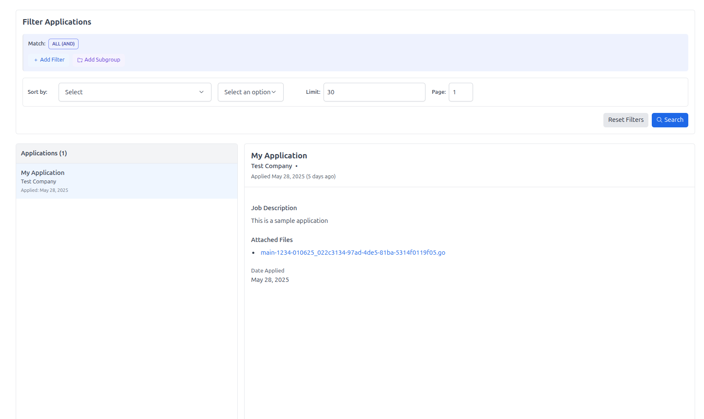

# Track Job Applications

---------------------------
Web extension created with Vue and Vite, from
the [Web Extension Template](https://github.com/antfu-collective/vitesse-webext)
by [antfu](https://github.com/antfu).

This extension works by opening a side panel in the browser, where job posting details can be filled out manually or
parsed from various websites with LLM models (including OpenAI, Google, Anthropic, Ollama). \
It also allows users to
upload files related to job applications and
automatically sends the job postings and attached files to an external database (customizable).
The extension can automatically pick up files that are uploaded to a website (when the extension is active).
Uploaded files can be previewed with a pop up.


----------------

----------------

## Installation

You can install by downloading/cloning the source code and run `pnpm build` to build the extension, then load it as an
unpacked extension in your browser. You will also need a backend/storage option (see the Backend Service section
below).\
There is no plan to publish it to the Chrome Web Store or Firefox Add-ons.

## Backend Service

The extension requires a backend to store job postings and files. The base URL can be set in the setting menu.\
A basic implementation is provided [here](https://github.com/mac-op/job-tracker-backend), which uses Golang, AWS Lambda,
S3 and CockroachDB. [This](https://github.com/mac-op/app-tracker-sheets) is another implementation with FastAPI that uses
Google Sheets and Google Drive as a datastore.

Data fetched from the backend will populate the dashboard at the extension options page, where one can query and edit
past application details.



The backend should implement the following endpoints:

### `POST /job`

Uploads a job application and optional associated files.

**Headers**

- Content-Type: multipart/form-data

    - Form Fields
        - application (required): JSON-encoded object representing the job application.
        - files (optional): One or more files to be attached (e.g., resume, cover letter).

`application` JSON:

  ```json
  {
    "title": "string",
    "description": "string",
    "company": "string",
    "location": "string",
    "url": "string",
    "date_posted": "string (YYYY-MM-DD)",
    "internal_id": "string",
    "source": "string",
    "reposted": "boolean",
    "date_applied": "string (YYYY-MM-DD)",
    "num_files": "integer"
}
  ```

Sample request:

  ```bash
  POST /upload
  Content-Type: multipart/form-data; boundary=----123
  
  ------123
  Content-Disposition: form-data; name="application"
  Content-Type: application/json
  
  {
  "title": "My Application",
  "description": "This is a sample application",
  "company" : "Test Company"
  }
  ------123
  Content-Disposition: form-data; name="files"; filename="text.txt"
  Content-Type: text/plain
  This is the content of the file.
  ------123
  ```

### `POST /applications`

Queries job applications based on provided filters and pagination options. Top-level fields:

`where` (object) - A collection of conditions, ie. `filters` or groups of conditions (`subgroups`). Subgroups could have
their own subgroups and filters. \
`sort_by` (string) - Field to sort on (optional).\
`sort_order` (string) - `asc` or `desc` (optional).\
`limit` (number) - Maximum number of records (optional).\
`page` (number) - Page number for pagination (optional).

**Example:**

- Request
    ```json
    {
        "where": {
            "filters": [
                {
                    "field": "title",
                    "operator": "contains",
                    "value": "engineer"
                }
            ],
            "subgroups": [
                {
                    "filters": [],
                    "subgroups": [],
                    "operator": "or"
                }
            ],
            "operator": "and"
        },
        "sort_by": "company",
        "sort_order": "asc",
        "limit": 10,
        "page": 1
    }
    ```
- Response:

    ```json
    {
        "results": [
            {
                "id": "",
                "title": "",
                "description": "",
                "company": "",
                "url": "",
                "date_posted": "",
                "internal_id": "",
                "source": "",
                "reposted": false,
                "date_applied": "2023-06-02T00:00:36.917Z",
                "files": ["file.txt"]
            }
        ]
    }
    ```

### `PUT /job/:id`:

Update a specific job application by ID

```json
{
    "title": "Updated Title",
    "description": "Updated Description",
    "company": "Updated Company",
    "location": "Updated Location",
    "url": "https://updated-url.com",
    "date_posted": "2023-10-01",
    "internal_id": "12345",
    "source": "Updated Source",
    "reposted": false,
    "date_applied": "2023-10-02"
}
```
